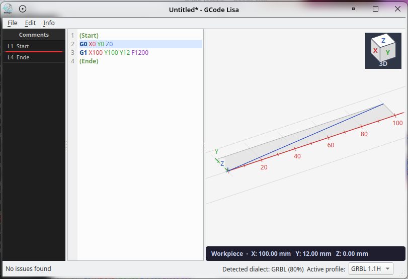
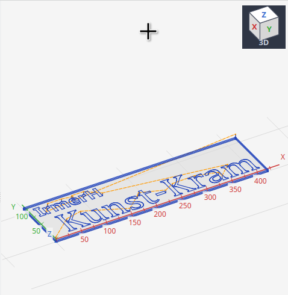

# GCode Lisa


> Cut with confidence.
>
> Waste less.


> Interactive dual-view GRBL G-Code visualizer and analyzer for CNC machines under Linux/KDE

## Features

- **Dual-view interface**: Side-by-side G-Code editor and interactive 3D canvas visualization
- **Bidirectional sync**: Click a line in the editor to highlight the corresponding path on the canvas, and vice versa
- **Multi-dialect support**: GRBL 1.1 / 1.1H / 1.1j, LinuxCNC, and Marlin with auto-detection and per-dialect command validation
- **Syntax highlighting**: Color-coded G/M commands, axis words, arc parameters, feed rate, and comments
- **Contextual hover tooltips**: Hover any token in the editor to see its value and any analysis issues for that line
- **Comment browser**: Instant navigation to named operations/sections exported by CAM software
- **Workpiece size analysis**: Automatic bounding box calculation and workpiece dimension display
- **Coordinate origin display**: Visual indicator for the work coordinate origin
- **Warnings and hints**: Dialect compatibility errors, missing origin detection, feed rate checks
- **Optimization hints**: Detects redundant rapids, repeated tool changes, and other inefficiencies
- **View cube**: Clickable orientation cube to snap to standard orthographic views

## Screenshots





## Tech Stack

| Component | Technology |
|-----------|------------|
| Language  | Python 3.10+ |
| GUI       | PyQt6 |
| Numerics  | numpy |
| Testing   | pytest |

## Quick Start

```bash
git clone https://github.com/dasarne/grbl-visualizer.git
cd grbl-visualizer

# Create and activate a virtual environment (required on Arch Linux and
# any distribution that enforces PEP 668 / externally-managed-environment)
python3 -m venv .venv
source .venv/bin/activate

pip install -r requirements.txt
python -m src.main
```

## Install on Linux

Register launcher + file associations for `*.gcode` and `*.nc`:

```bash
chmod +x scripts/install_linux.sh scripts/uninstall_linux.sh
./scripts/install_linux.sh
```

Remove registration:

```bash
./scripts/uninstall_linux.sh
```

> **Arch Linux note:** Arch enforces the "externally managed environment" policy (PEP 668),
> which prevents system-wide `pip install`.  Always activate the `.venv` first.

## Architecture Overview

The project is organized into focused modules:

```
src/
├── gcode/      # G-Code parsing, tokenization, GRBL command definitions
├── geometry/   # Coordinate transforms, bounding box, tool-path building
├── analyzer/   # Version compatibility warnings and optimization hints
└── ui/         # PyQt6 dual-view main window, editor panel, canvas panel
```

See [ARCHITECTURE.md](ARCHITECTURE.md) for the full design document.

## Development

See [DEVELOPMENT.md](DEVELOPMENT.md) for environment setup, testing, and code style guidelines.

## Keyboard Shortcuts

| Shortcut | Action |
|----------|--------|
| `Ctrl+N` | New window |
| `Ctrl+O` | Open file |
| `Ctrl+S` | Save file |
| `Ctrl+Z` | Undo |
| `Ctrl+Y` | Redo |
| `Ctrl+F` | Find |
| `Ctrl+H` | Find & Replace |
| `Ctrl+I` | Open Messages dialog |
| `Ctrl+Q` | Quit |

> **Note:** This project uses an AI-assisted development workflow where GitHub Copilot coding agent implements features described in structured issues, guided by skills and architecture documents.

## Contributing

1. Fork the repository
2. Create a feature branch (`git checkout -b feature/my-feature`)
3. Make your changes following the code style guidelines in DEVELOPMENT.md
4. Run tests: `pytest tests/`
5. Submit a pull request using the PR template

## Support The Project

GCode Lisa is maintained as an independent project. Reliable, practical CNC
software in the open-source ecosystem depends heavily on private engagement:
time for bug fixes, user support, compatibility updates, and long-term care.

If you want to support ongoing development, you can sponsor the project here:

[](https://github.com/sponsors/dasarne)
