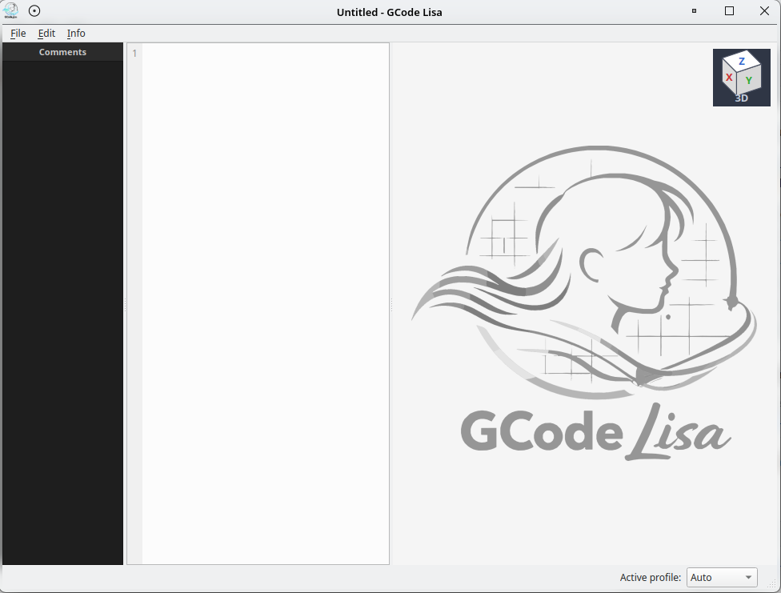
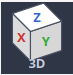
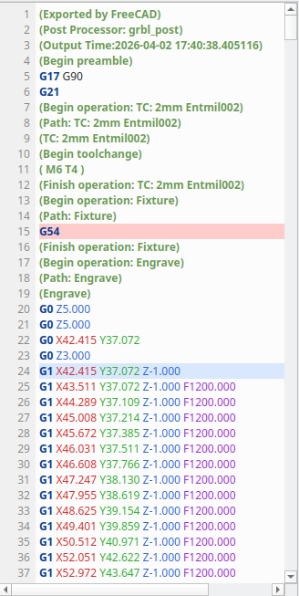
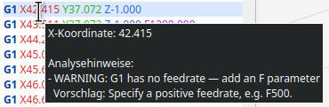
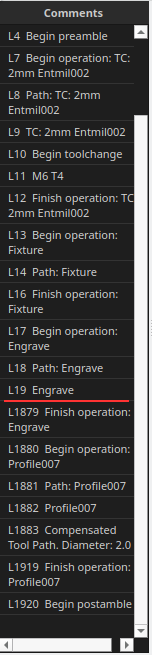
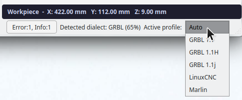
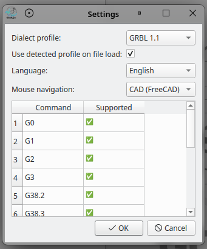
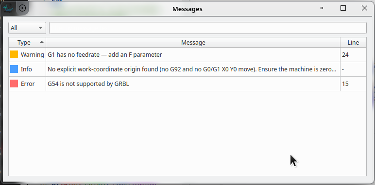

# GCode Lisa — User Guide

> Cut with confidence.
>
> Waste less.

---

## Interface Overview

When GCode Lisa starts, you see three panels side by side:

| Panel | Purpose |
|-------|---------|
| **Comments** (left) | Lists all comment lines from the G-code file — click a comment to jump to it |
| **Editor** (centre) | Syntax-highlighted G-code editor with line numbers |
| **Canvas** (right) | Interactive 3D toolpath visualization |

The **status bar** at the bottom shows the active dialect profile and any detected issues.

---

## Loading a File

Open a G-code file via **File → Open** (`Ctrl+O`) or by opening a recent file from **File → Recent Files**.

Supported formats: `.gcode`, `.nc`, `.ngc`, `.tap`

Once loaded, the editor and canvas update simultaneously:

- The **Comments panel** (left, dark) lists every comment/operation label in the file. Click any entry to jump to that line in the editor and highlight the corresponding path segment on the canvas.
- The **status bar** (bottom) shows the detected dialect (e.g. *Detected dialect: GRBL (80%)*), the active profile selector, and a clickable issue counter if problems were found.
- The **workpiece dimensions** box in the bottom-right corner of the canvas shows the bounding box (X / Y / Z extents).

---

## Understanding the Visualization

### 3D Axonometric View

The canvas renders an axonometric (isometric) projection of the toolpath:

- **Solid blue lines** — cutting moves (G1/G2/G3)
- **Dashed orange lines** — rapid traverse moves (G0)
- **Grey box** — workpiece bounding box
- **Axis markers** — X (red), Y (green), Z (blue) axes at the origin

### View Cube

The orientation cube in the top-right corner of the canvas shows the current viewing direction:

Click any face of the cube to snap the view to a standard orthographic orientation (Top, Front, Side, etc.). The cube label shows the current mode (*3D*, *Top*, *Front*, …).

### Navigation

| Action | Result |
|--------|--------|
| Mouse wheel | Zoom in / out |
| Left-drag | Pan |
| Right-drag | Rotate |
| Ctrl + right-drag | Rotate (alternative) |

The mouse navigation scheme can be changed in **Settings** (see below) to match FreeCAD, Blender, SolidWorks, and other CAD packages.

---

## The Editor

The editor provides syntax highlighting for G-code:

- **Blue** — G and M commands (G0, G1, M3, …)
- **Red / Green / Blue** — X, Y, Z coordinates
- **Orange** — I, J arc parameters
- **Purple** — F feed rate
- **Bold green** — comments (parenthetical `(…)` and semicolon `; …`)

Lines with analysis issues are highlighted in the editor background. Hover the mouse over any token to see a **contextual tooltip**:

The tooltip shows the value of the token (e.g. *X-Koordinate: 42.415*) and any analysis warnings that apply to that line.

### Line Selection (Editor + Canvas Sync)

Selection is line-based and unified across editor, search scope, and canvas highlighting.

| Interaction | Result |
|-------------|--------|
| Click | Select one line and set the anchor |
| Shift+Click | Select a contiguous range from anchor to clicked line |
| Ctrl+Click | Toggle individual lines (non-contiguous multi-select) |
| Drag with left mouse button | Extend the selection range while dragging |
| Shift+Arrow | Extend a contiguous range from anchor |
| Arrow | Move to a single-line selection |
| Ctrl+A | Select all lines |
| Ctrl+C / Ctrl+X | Copy / cut selected lines |
| Delete / Backspace | Delete selected lines |
| Type printable text | Replace selected lines with typed text |

Double-click is intentionally treated like single-line selection (no word-level selection mode).

When lines are selected, editor and canvas remain synchronized.

### Find & Replace

Open Find & Replace with `Ctrl+F` or `Ctrl+H`. Type in the search field and use the buttons to navigate matches or replace them one by one / all at once.

---

## Comment Browser

The left panel lists every comment line in the file:

Click any entry to jump to the corresponding line in the editor and highlight the matching path segment on the canvas. This makes it easy to navigate a file that was exported from CAM software with named operations.

---

## Dialect Profiles & Auto-Detection

GCode Lisa supports multiple G-code dialects: **GRBL 1.1**, **GRBL 1.1H**, **GRBL 1.1j**, **LinuxCNC**, and **Marlin**.

On file load, GCode Lisa automatically detects the most likely dialect based on the commands used. The detected dialect and the currently active profile are shown in the **status bar**:

- **Detected dialect** — the result of automatic analysis, shown with a confidence percentage
- **Active profile** — controls which commands are considered valid; defaults to *Auto* (follows the detected dialect)

To override the dialect permanently, select a profile from the drop-down. Changes take effect immediately and are saved for the next session.

---

## Settings

Open **File → Settings** to configure global preferences:

| Setting | Description |
|---------|-------------|
| **Dialect profile** | Default profile when *Auto* detection is off |
| **Use detected profile on file load** | When checked, the active profile updates automatically on each file open |
| **Language** | UI language (English / Deutsch) |
| **Mouse navigation** | Navigation scheme: CAD (FreeCAD), Blender, SolidWorks, and many others |

The command table at the bottom of the dialog lists all G-code commands and whether they are supported by the selected profile.

---

## Messages & Warnings

When GCode Lisa detects potential issues in the loaded file, the status bar shows a clickable issue counter (e.g. *Error:1, Info:1*). Click it — or press `Ctrl+I` — to open the Messages dialog:

Each row shows:

| Column | Meaning |
|--------|---------|
| **Type** | Severity: Error (red), Warning (yellow), Info (blue) |
| **Message** | Description of the issue |
| **Line** | Line number in the editor (click row to jump there) |

Use the **filter drop-down** (All / Error / Warning / Info) and the **text search** field to narrow down the list. Click any column header to sort.

### Warning types explained

| Type | Example | Action |
|------|---------|--------|
| **Error** | *G54 is not supported by GRBL* | Command not supported by the active profile — check dialect setting or remove the command |
| **Warning** | *G1 has no feedrate — add an F parameter* | Potentially dangerous omission — add an explicit F value before the move |
| **Info** | *No explicit work-coordinate origin found* | Advisory only — ensure the machine is zeroed correctly before running |

---

## Keyboard Shortcuts

| Shortcut | Action |
|----------|--------|
| `Ctrl+N` | New window |
| `Ctrl+O` | Open file |
| `Ctrl+S` | Save file |
| `Ctrl+Z` | Undo |
| `Ctrl+Y` | Redo |
| `Ctrl+A` | Select all lines |
| `Ctrl+C` | Copy selected lines |
| `Ctrl+X` | Cut selected lines |
| `Delete` / `Backspace` | Delete selected lines |
| `Ctrl+V` | Paste |
| `Ctrl+F` | Find |
| `Ctrl+H` | Find & Replace |
| `Ctrl+I` | Open Messages dialog |
| `Ctrl+Q` | Quit |
